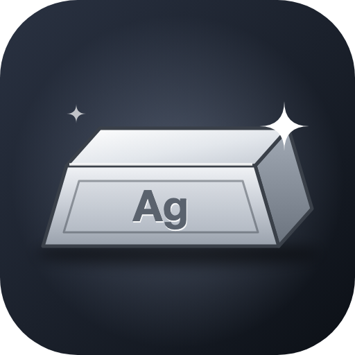
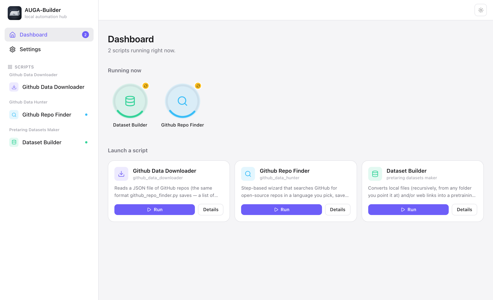
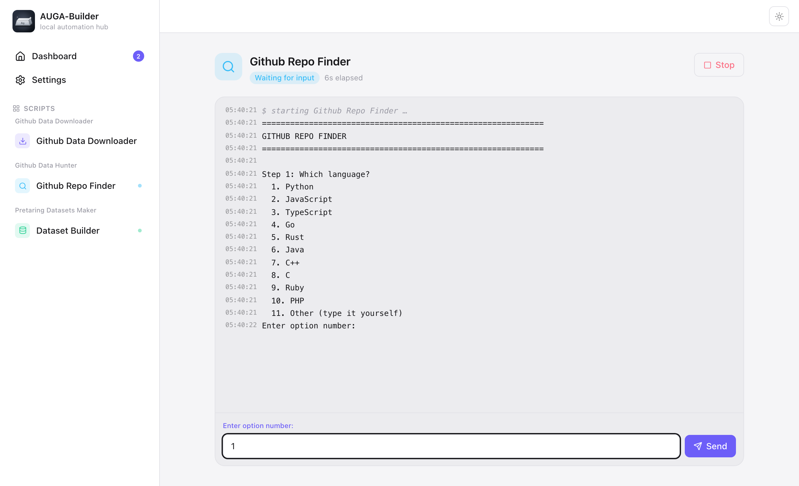

<p align="center"></p>

<h1 align="center">AUGA-Builder</h1>

<p align="center">Run your Python scripts from a clean, simple app. No terminal, no setup.</p>

<p align="center"></p>

AUGA-Builder turns Python scripts into something anyone can click and run.
Pick a script from the sidebar, press **Run**, and answer its questions in
normal text boxes instead of typing into a terminal. You can run several
scripts at once and watch each one's progress ring on the dashboard.

- **Nothing to install.** The app brings its own Python. It doesn't matter
  what Python, if any, is on your computer.
- **Opens in its own window.** It's a normal app, not a browser tab or a
  terminal.
- **Works with ordinary scripts.** Any script that asks questions with
  `input()` works as-is; you don't have to change it.
- **Private.** Everything runs on your own computer. The app only listens on
  `127.0.0.1`, so nothing on your network or the internet can reach it.

## Download

<!-- DOWNLOADS:START (kept up to date by upload.sh) -->
**[Latest release](https://github.com/karanleo-coder/AUGA-Builder/releases/latest)** · direct downloads:

| OS | Download | Run |
|---|---|---|
| Windows (64-bit) | [AUGA-Builder-windows-x64.zip](https://github.com/karanleo-coder/AUGA-Builder/releases/latest/download/AUGA-Builder-windows-x64.zip) | unzip, open the `AUGA-Builder` folder, double-click `AUGA-Builder.exe` |
| macOS (Apple Silicon) | [AUGA-Builder-macos-arm64.tar.gz](https://github.com/karanleo-coder/AUGA-Builder/releases/latest/download/AUGA-Builder-macos-arm64.tar.gz) | unzip, double-click `AUGA-Builder.app` (drag it to Applications if you like). First launch: right-click → Open, since it isn't Apple-notarized |
| Linux (64-bit) | [AUGA-Builder-linux-x64.tar.gz](https://github.com/karanleo-coder/AUGA-Builder/releases/latest/download/AUGA-Builder-linux-x64.tar.gz) | unzip, `cd AUGA-Builder && ./AUGA-Builder`. Run `./add-to-app-menu.sh` once to get it (with its icon) in your app menu |
<!-- DOWNLOADS:END -->

These links always get the newest version.

## Opening it the first time

AUGA-Builder is free and isn't signed with a paid developer certificate, so
your computer asks once whether you trust it.

**Windows.** Unzip the download, open the `AUGA-Builder` folder and
double-click `AUGA-Builder.exe`. If you see *"Windows protected your PC"*,
click **More info → Run anyway**. Keep the whole folder together; the app
needs the files next to it.

**macOS.** Unzip the download and move `AUGA-Builder.app` to Applications
(optional). The first time, **right-click the app → Open → Open**. If macOS
only offers *Done* or *Move to Bin*, open **System Settings → Privacy &
Security**, scroll down and click **Open Anyway**. After that, open it like
any other app. It needs a Mac with Apple Silicon (M1 or newer).

**Linux.** Unzip the download, then in a terminal:

```bash
cd AUGA-Builder
./AUGA-Builder              # start it
./add-to-app-menu.sh        # optional, once: adds it (with its icon) to your app menu
```

On Linux the app opens in its own window through Chrome, Chromium, Edge or
Brave if one of them is installed. Without them, it opens in your normal
browser.

## Using AUGA-Builder

<p align="center"></p>

1. **Pick a script** in the sidebar, or press **Run** on one of the cards on
   the dashboard.
2. **Answer its questions.** When a script asks something, a box appears at
   the bottom of the screen. Type your answer and press **Enter** or
   **Send**. Answers to passwords and tokens are hidden.
3. **Watch it work.** Everything the script prints appears as it happens.
   Press **Stop** to cancel it.
4. **Run more at the same time.** Start other scripts whenever you like. The
   dashboard shows a ring for each one:
   - a spinning ring means it's working;
   - a yellow dot means it's waiting for your answer;
   - a check mark means it finished, and a cross means it failed.

   Point at a ring to see what it's doing; click it to open that script.

The sun/moon button at the top right switches between light and dark mode.

**Closing the app:** close the window. If a script is still running, it
asks before stopping it. Opening AUGA-Builder again while it's already open
just brings the window back.

## Data Editor: edit data files like a spreadsheet

Click **Data Editor** in the sidebar (or on the dashboard) to open
**Parquet, Arrow, JSON, JSONL or CSV** files in a spreadsheet you can edit
directly.

- **Open** a file with **Open…**, from **Recent files**, or by dropping it
  on the page. **New** starts an empty file: name your columns and pick
  their types.
- **Edit like Excel:** click a cell and type (or press Enter to change what's
  there), use the arrow keys and Tab to move, **Delete** to clear a cell, and
  paste a block copied from Excel or Google Sheets. Values are checked
  against the column type, so a word in a number column is refused.
  Dates and yes/no columns get a date picker and a Yes/No choice.
- **Rows and columns:** **+ Row**, **Insert row below**, **Delete row**
  (click row numbers to pick several; Shift/⌘-click for more),
  **+ Column**. Click a column's header to sort it, rename it, change its
  type, insert a column beside it, or delete it.
- **Pages:** rows are shown 100 at a time (or 50 / 200, under **Rows per
  page**), so even files with millions of rows stay quick on slower
  computers. Use **‹ Prev / Next ›**, **« / »** for the first and last page,
  or type a page number.
- **Columns fit their text:** each column opens wide enough for its text
  (very long text wraps or ends in "…"). Drag a column's right edge, or use
  its header menu for **Fit to contents**, **Wider**, **Narrower** or
  **Reset width**.
- **Row height:** **Compact · Normal · Tall · Full text**. **Full text**
  makes every row as tall as it needs to be, so all of its text is visible.
- **Expand row:** select a row and click **Expand row** (or double-click
  its row number). The row opens in a floating window, laid out like the
  sheet with every value shown in full. **Prev row / Next row** move
  through the rows without closing it, applying your changes as you go
  (also ⌘⇧↑ / ⌘⇧↓, or Ctrl+Shift+↑ / ↓). **Apply changes** or
  ⌘Enter / Ctrl+Enter saves, and Esc or ✕ closes it.
- **Zoom:** the **− 100% +** buttons, or ⌘+ / ⌘− / ⌘0 (Ctrl on Windows and
  Linux). Text and columns grow together. Your zoom and row height are
  remembered.
- **Undo** with the Undo button or ⌘Z / Ctrl+Z. Save with ⌘S / Ctrl+S.
- **Clean data** (under **Tools ▾**, or a column's header menu):
  - **Duplicate rows:** pick the columns that must match, for example just
    `email` (or leave **All columns** for exact copies). Matching rows are
    shown side by side, and in each group the row with the least data is
    already ticked for removal. Empty cells and fillers like "N/A" or
    "null" count as missing. Change the ticks if you like, then
    **Remove rows**.
  - **Find by keyword:** type a word or value to find the rows that
    contain it, either in every column or only the columns you pick. Then
    remove those rows, replace the text, or empty the matching cells.
  - Click a row number in the results to see it in the sheet, then
    **Back to Clean data**. Every change can be undone with Undo.
- **Save in any format:** the switch at the top (**Parquet · Arrow · JSON ·
  JSONL · CSV**) is the format the file is saved in. Pick a different one to
  **convert**: opening `data.json` and saving with **Parquet** selected
  writes `data.parquet` next to it. **Save as…** chooses a new name or place.

Parquet and Arrow keep every column's exact type. JSON, JSONL and CSV
store plain text and numbers; when opening them, the editor recognises
dates again, so converting JSON to Parquet keeps real dates. Nested values
(lists, objects) are shown but can't be edited, and are saved back
unchanged.

## Adding your own scripts

Go to **Settings → Add scripts** (or **Add scripts** on the dashboard) and
either **drop** something on it or use the buttons:

- **a folder** with your project in it (**Choose folder…**),
- **a .zip** of that folder, or **a single .py file** (**Choose .zip or .py…**).

That's all. AUGA-Builder copies it into your scripts folder and works out
which files are the scripts you run, so helper files like `utils.py` don't
clutter the sidebar. If the project has a `requirements.txt`, the packages
in it are installed for you, and you can watch that happen. Add the same
project again later and it offers to replace the old copy with the new one.

It picks the scripts to show like this: files with
`if __name__ == "__main__":` in them; otherwise files called `main.py`,
`app.py`, `run.py` and so on; otherwise the `.py` files at the top of the
folder. To show another file too, use **Pick a file already in your
scripts folder** at the bottom of Settings.

Everything you add lives in the **AUGA-Builder** folder in your home folder:

| | Scripts folder |
|---|---|
| Windows | `C:\Users\<you>\AUGA-Builder\scripts` |
| macOS | `/Users/<you>/AUGA-Builder/scripts` |
| Linux | `/home/<you>/AUGA-Builder/scripts` |

You can also copy files in there yourself (**Settings → Open folder**), then
click **Rescan for new scripts**. In Settings you can rename any script and
give it an icon and a colour. Some example scripts come with the app so you
can try it straight away.

**If a script needs another package** (it stops with *"No module named
…"*), type the package name into **Settings → Install a Python package**,
for example `openpyxl`. After that every script can use it. `requests`,
`pandas`, `beautifulsoup4`, `trafilatura` and `pyarrow` are already
included.

## Updating

Download the latest version from the link above and replace the old app
with it. Your scripts, installed packages and settings are kept, because
they live in your `AUGA-Builder` home folder, not inside the app.

## Uninstalling

Delete the app (on Windows and Linux, the whole `AUGA-Builder` folder you
unzipped). To also remove your scripts and settings, delete the
`AUGA-Builder` folder in your home folder.

## Something not working?

- **The window didn't appear.** Open the app again; if it's already running,
  that brings the window back. You can also visit `http://127.0.0.1:8756`
  in a browser.
- **A script failed.** Its window shows the error. *"No module named X"*
  means it needs a package: install X from Settings.
- **The app itself won't start.** Its log is `launcher.log` in the `data`
  folder inside your `AUGA-Builder` home folder. Please include it when you
  report a problem.
- **Windows: the app opens in an Edge window instead of its own.** Your PC
  is missing Microsoft's WebView2 component (built into Windows 11).
  Installing the
  [WebView2 Runtime](https://developer.microsoft.com/microsoft-edge/webview2/)
  fixes it.

Report problems or ideas on the
[Issues page](https://github.com/karanleo-coder/AUGA-Builder/issues).
